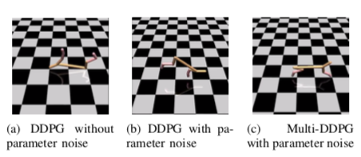

# Multi-DDPG-with-parameter-noise on OpenAI games in Pytorch

  

There are some deficiencies of traditional reinforcement learning algorithm, such as data inefficiency, compu- tation inefficiency on single computer, unintelligent exploration problem, and not leveraging previous trained data. Recent algorithms, such as DDPG, A3C and TRPO solve one or some of these in some degree. The vanilla DDPG improves the exploration through Actor and Critic, and has a reply buffer to memorize samples including states, action and so on to leverage previous trained data. Adding noise based Ornstein Uhlenbeck process to action space is also an intelligent way to get a better exploration, which accelerates the convergence. However, it still can be get into the local minimum place and converge slowly even though implementing those mentioned above. In this project, the algorithm adds noise directly to the agents parameters to obtain a richer set of behavior and has a so called Multi-DDPG structure to choose best agent among agents in current episode as a distributor for next episode to reduce the chaos.

  

Multi-DDPG with parameter noise, in this case, achieves significantly higher returns than all other configurations. That makes sense because this algorithm allows data collection and network training to be distributed. Thus, Multi-DDPG helps to guide the learning process towards good solutions and reduce the pressure on exploration strategies and speed up learning. Hence, that is why our algorithm always develop a high-scoring gallop among the three methods.

